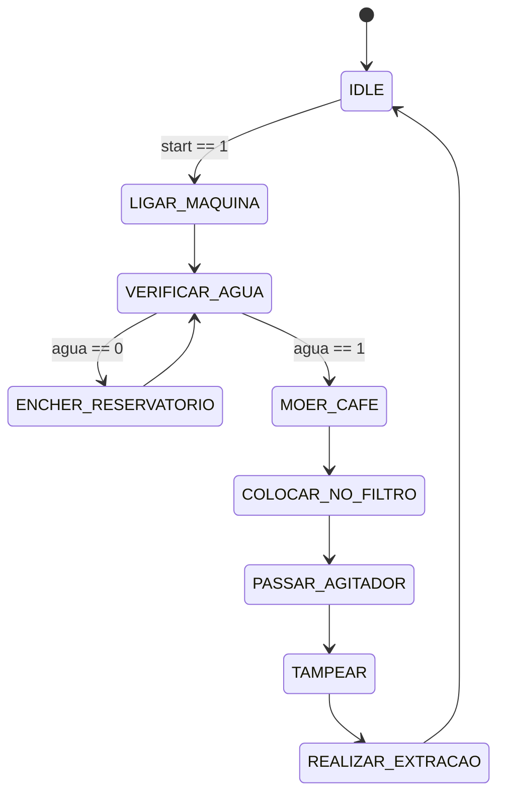

# Máquina Maluca

Motivado pela ambição de continuar desenvolvendo soluções personalizadas, o autor desta atividade decidiu dar mais um passo ousado: criar uma **máquina de estados**. A inspiração? Automatizar o preparo de um bom café expresso. Porém, em mais um momento de distração — possivelmente causado por um nível perigosamente baixo de cafeína — o projeto tomou rumos inesperados...

## A Máquina de Estados

Como grande apreciador de café, o autor quis representar todo o processo de preparo de um expresso — desde a moagem até a extração final — por meio de uma máquina de estados finitos.

### Estados da Máquina

A máquina começa no estado **IDLE**, aguardando o sinal `start = 1` para iniciar o preparo.

A sequência correta de estados segue a seguinte lógica:

1. **IDLE**
   Estado inicial. Aguarda o sinal de início (`start = 1`).

2. **Ligar Máquina de Café**
   A máquina é ligada e começa a pré-aquecer.

3. **Verificar Água**
   Verifica se o reservatório contém água.

   * Se **não houver água**, a máquina transita para o estado **Encher Reservatório**.
   * Se **houver água**, segue para o estado **Moer Café**.

4. **Encher Reservatório**
   O reservatório é preenchido. Importante: uma vez cheio, ele permanece abastecido até o fim do dia. Após esse estado, a máquina retorna a **Verificar Água**, que agora permite seguir o fluxo normalmente.

5. **Moer Café**

6. **Colocar no Filtro**

7. **Passar Agitador**

8. **Tampear**

9. **Realizar Extração**

Após a extração, a máquina retorna ao estado **IDLE**, pronta para iniciar um novo ciclo quando `start` for acionado novamente.

### Diagrama da Máquina de Estados

O diagrama abaixo ilustra o funcionamento esperado da máquina:



Ao iniciar, o estado da máquina é sempre **IDLE** e o reservatório de água está vazio. Os estados da máquina são expostos ao módulo superior e devem ser testados em tempo real durante a simulação.

---

## O Problema

Infelizmente, algo deu muito errado. A máquina está **maluca**: executando os passos na ordem errada, pulando etapas importantes, e deixando o café inacabado. O autor, desapontado com o resultado e ainda sem café, resolveu abandonar a implementação.

Agora é com você: sua missão é **testar**, **descobrir os problemas** e **corrigir** o comportamento da máquina de estados.

A implementação original está no arquivo `maquina_maluca.v`.

---

## Atividade

Sua tarefa é:

1. Implementar o **testbench** no arquivo `tb.v`, utilizando o seguinte template:

```verilog
`timescale 1ns/1ps

module tb();

reg clk;
reg rst_n;
reg start;
wire [3:0] state;

maquina_maluca dut (
    .clk   (clk),
    .rst_n (rst_n),
    .start (start),
    .state (state)
);


initial begin
    // Insira o seu teste aqui
end

endmodule

```

2. **Simular a máquina** com diferentes execuções.
3. **Observar o comportamento** e identificar desvios da lógica esperada.
4. **Corrigir os erros** no arquivo `maquina_maluca.v`.

---

## Entrega

Nesta atividade, o sistema de correção automática do **GitHub Classroom** **não fornecerá um feedback detalhado equivalente à correção final**. Ele apenas verifica:

* Se os arquivos foram entregues corretamente;
* Se o módulo compila e passa pelo **testbench implementado por você**.

A avaliação completa será feita utilizando:

* Um **testbench de referência** aplicado ao **módulo corrigido**;
* Uma análise do seu próprio testbench, avaliando a **abrangência dos testes** e sua capacidade de validar corretamente os estados.

Por isso, recomenda-se fortemente a criação de um testbench robusto, que cubra **casos de borda**, transições incorretas e falhas na sequência dos estados.

> **Dica:**
>
> * O script `./run.sh` realiza a compilação, síntese e execução do seu testbench juntamente com os módulos.
> * O script `./run-all.sh` executa o mesmo processo, mas **limita a saída apenas às palavras "OK" ou "ERRO"**, conforme encontradas nas linhas de resultado. Isso pode ser útil para obter uma visão rápida da simulação, especialmente se seu testbench for programado para emitir essas palavras com base no sucesso ou falha dos testes.

